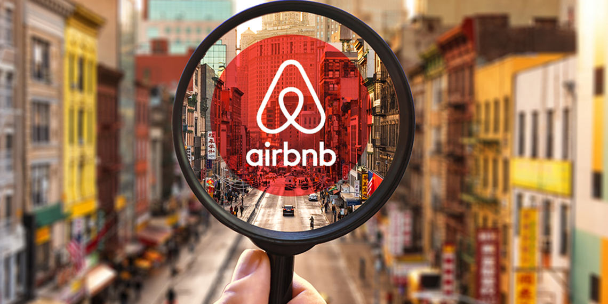

# AirBnB Listing & Reviews
Airbnb is an online marketplace that connects people who want to rent out their homes with travelers seeking accommodations. 

## Project Link

[AirBnB Impact of Regulations](https://www.kaggle.com/code/naynishb/airbnb-project-1)

## 🎯 Project Overview :
This dataset contains Airbnb data for over 250,000 listings across 10 major cities worldwide. It includes detailed information about hosts, pricing, locations, room types, and over 5 million historical guest reviews. The dataset provides valuable insights for studying trends in the short-term rental market.

## 🔍Dataset :
The dataset includes the following files:
- listings.csv
Contains detailed information about Airbnb properties, including host details, location, pricing, and room types.
- reviews.csv
Includes guest reviews for Airbnb properties, covering feedback, review dates, and reviewer details.
- Dataset Source : [AirBnB Listing and Review Dataset](https://www.kaggle.com/datasets/mysarahmadbhat/airbnb-listings-reviews)

 ## 🛠️ Tools & Technologies Used :
   

## 📊Insights :

📈 The Number of AirBnBs kept on increasing since the launch and prices kept on increasing too, due to initial traction and early adopters.

📉 After the startup is known to everyone and becomes a common utility, AirBnBs start increasing in numbers and prices also kept on decreasing.

⚠ After regulation was announced around 2015 there was under confidence in the business, number of AirBnBs started decreasing and prices started increasing.

🔄 Once the regulation is the new normal, during the year 2019 the number of AirBnBs have increased in number and prices kept decreasing due to more supply of them.

## 🚀Recommendation :

📉 Regulations in long term rentals can impact the business adversely, there might be customer and hosts churn due to uncertainty.

💸 Such regulations might add to AirBnBs losses which might be difficult to recover later.

🛑If the customer experience is going to get impacted due to this, it would lead to incorrect brand perception.

👁‍🗨It is recommended to watch out for any such regulations at other places and be prepared for it.

📋AirBnB can replicate such regulations at other places.

🔐They can keep strict rules to onboard and release the hosts.

🌐They can limit the number of AirBnBs in a locality to ensure the public has enough rental options and the government doesn't step in.
